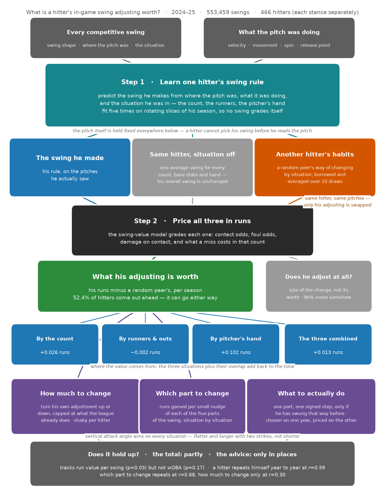

# swing-repertoire

Statcast bat tracking (MLB 2024–2026) gives us swing geometry on every competitive swing, including whiffs and fouls. That makes it possible to study what a hitter's different swing shapes are worth in context, and whether changing his swing for the situation actually helps him.

Two questions:

1. **Swing-shape value.** What is the run value of each hitter's distinct swing shapes, given the pitch he's facing?
2. **Adjustment value.** Does moving the swing around with the situation pay — and for the hitters it doesn't pay for, what should they do instead?

Data: Driveline `mlb_db`. Methodology: `docs/research-design.md` and `docs/adjustability-methodology.md` (not in this repo).

## What's built

A per-batter GMM groups each hitter's swings into distinct shapes (median 2, max 6). An xRV model grades each shape against the pitch it met and scales it as **Swing+** (50 = league average). **Repertoire+** measures how wide that shape portfolio is. **Adjustability** measures how much bat speed, swing length and tilt track the situation once you account for where the pitch was. **Adjustment value** prices that movement in runs, by re-scoring each hitter's season under a different situational policy. The **playbook** turns the price into an instruction — which dial to move, in which situation, by how many degrees.



## Pipeline

Run from repo root with the `driveline` env active. Each stage reads the parquet the stage above it wrote.

**Foundation** — every later stage depends on these three, in this order.

```bash
python src/uncommited/extract.py    # mlb_db → swings_2024_2026_mlb.parquet   (slow: full DB pull)
python src/uncommited/features.py   # competitive-swing filter → swings_model.parquet
python src/cluster.py    # per-batter GMM → cluster_*, batter_repertoire
python src/xRV_model.py  # per-swing run value → xrv_swings.parquet
```

`cluster.py` and `xRV_model.py` both read `swings_model.parquet` and are independent of each other, but everything below needs both.

**Interpretability overlay** — names and describes the shapes `cluster.py` found. Nothing downstream depends on these; they exist to make a cluster readable.

```bash
python src/swing_label.py  # archetype lexicon → shape_archetypes.parquet
python src/uncommited/cards.py      # per-shape scouting cards → shape_cards.parquet
```

**Repertoire and adjustment** — the batter-level scalars.

```bash
python src/repertoire.py      # Repertoire+ (width)        → repertoire_scores.parquet
python src/adjustability.py   # adjustability (movement)   → adjustability.parquet
```

**Adjustment value** — hold the situation fixed, vary the behaviour, and price the difference.

```bash
python src/adjustability_value.py               # ~10 min
#   → adjustability_value.parquet (runs_total), adjustability_gradients.parquet
python src/uncommited/adjustability_value_validate.py      # ~25 min; --reuse skips the split-half recompute
#   → results/adjustability_value.md

python src/adjustability_policy.py              # what he should do instead   ~25 min
#   → adjustability_prescriptions.parquet, adjustability_playbook.parquet
#   → results/adjustability_playbook.md
#   --report-only re-runs just the readout (seconds), against the search already on disk
```

`adjustability_policy.py` is the one policy script, in two stages. The **search** tries a grid of signed steps on each dial, in each situation, and keeps the one worth the most runs — rejecting any swing the hitter has not already demonstrated. The **readout** turns those steps into instructions in the dial's own units ("with two strikes, swing 5.3° more level"), and pools them into a league policy and a power-vs-contact policy.

Every row says which of three levels to read it at — one batter, a hitter type, or the league — based on a split-half gate (`experiments/policy_search_gate.py`, which re-runs each season end to end). Count prescriptions repeat per batter; game-state ones only hold up as a league statement. Nothing is dropped for being noisy: an axis with a weak per-hitter number can still have a real league mean, and the annotation says so instead of hiding it.

`src/adjustability_value.py` reads top to bottom as one procedure — load, fit one hitter's swing rule, price a shape in runs, compare against a replacement, then the two prescription layers — with a numbered map in its module docstring. `tests/test_adjustability_value.py` pins the properties the argument depends on (the comparison swing is mean-preserving, the three axes sum to the total, every swing is predicted out of fold). `src/uncommited/pitch_controls.py` joins the pitch characteristics that keep a reaction to nastier stuff from being scored as volition.

**Presentation.**

```bash
python src/uncommited/leaderboard_preprocess.py   # big parquets → four small ones R can open
Rscript src/uncommited/leaderboard_table.R        # leaderboard PNGs via gt + mlbplotR
python src/uncommited/value_flowchart.py          # the diagram above
```

`leaderboard_preprocess.py` is not optional — Arrow hangs on macOS when R opens several large parquets at once, so all the aggregation happens in Python first.

**Utility.** `src/uncommited/db.py` exposes every project parquet as a DuckDB view for one-off queries. `src/uncommited/extract_pitch_chars.R` pulls pitch characteristics off Baseball Savant. `src/commit.py` is an auto-commit watcher, unrelated to the analysis.

## Notebooks

`src/cluster_results.ipynb`, `src/swing+_results.ipynb` and `src/adjustability_results.ipynb` save figures as PNGs into `results/plots/` subfolders. Tables render via `dataframe_image` (matplotlib backend). Use the "Python (driveline)" kernel.

## Environment

Uses the shared `driveline` venv at `~/.venvs/driveline` (uv, Python 3.13).

```bash
# activate (macOS/Linux)
source ~/.venvs/driveline/bin/activate

# recreate from scratch
uv venv ~/.venvs/driveline --prompt driveline
VIRTUAL_ENV=~/.venvs/driveline uv pip install -r requirements.txt
python -m ipykernel install --user --name driveline --display-name "Python (driveline)"

# add a package
VIRTUAL_ENV=~/.venvs/driveline uv pip install <pkg>
```

R 4.6.0 at `/usr/local/bin/Rscript` with arrow, dplyr, gt, gtExtras, mlbplotR, scales and webshot2. `gtsave()` needs headless Chrome via webshot2.

`data/` is gitignored and holds all extracts — never commit it. DB credentials (`BIOMECH_DB_HOST/PORT/USER/PASS`) resolve from `~/.claude/.env` via `get_secret()` in `src/uncommited/extract.py`. Only needed to re-pull raw data; the resume bundle already has every extract.

## New machine

See [`docs/project_resume.md`](docs/project_resume.md).

## Contributors

[@theoauyeung](https://github.com/theoauyeung)
